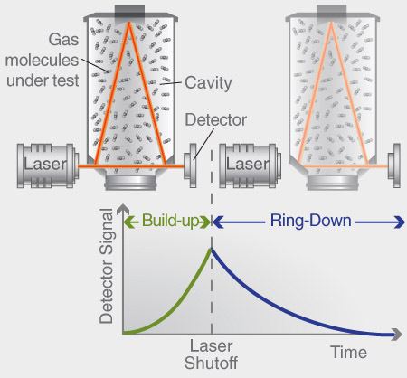
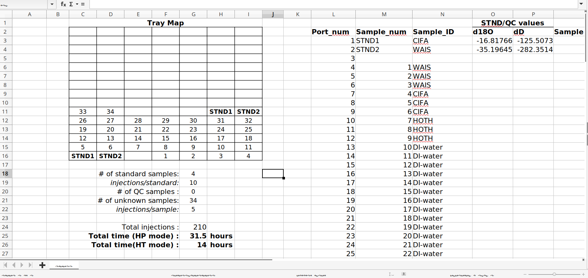
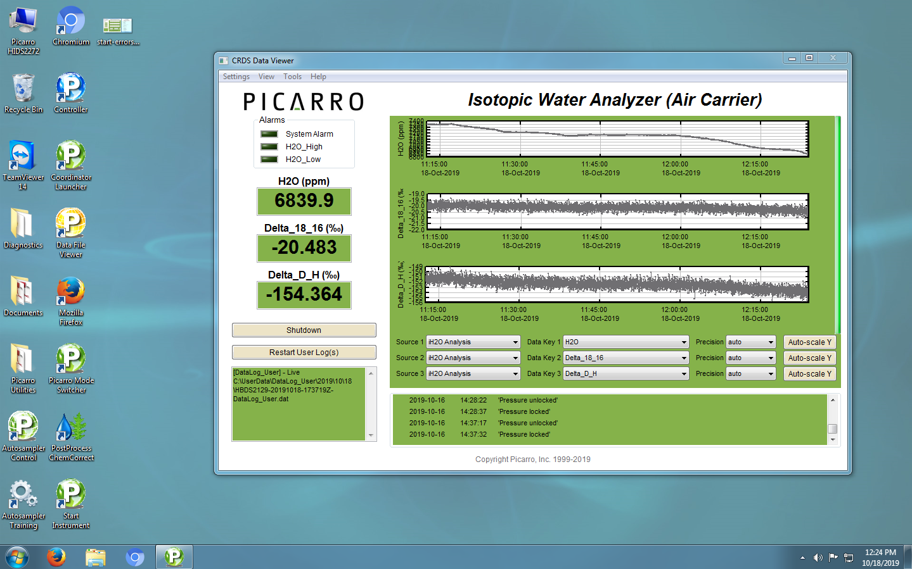
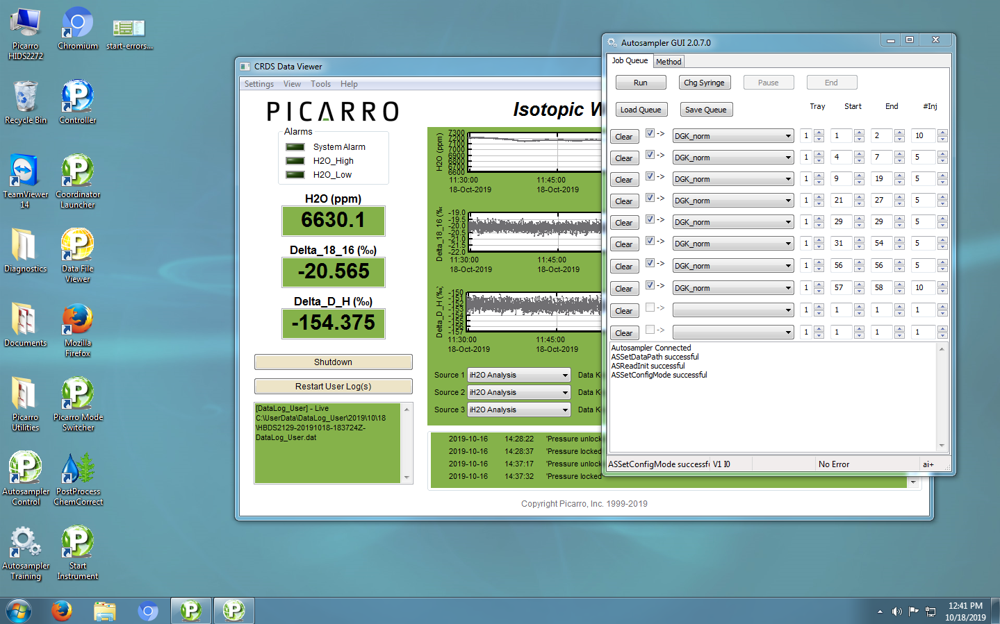
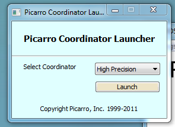
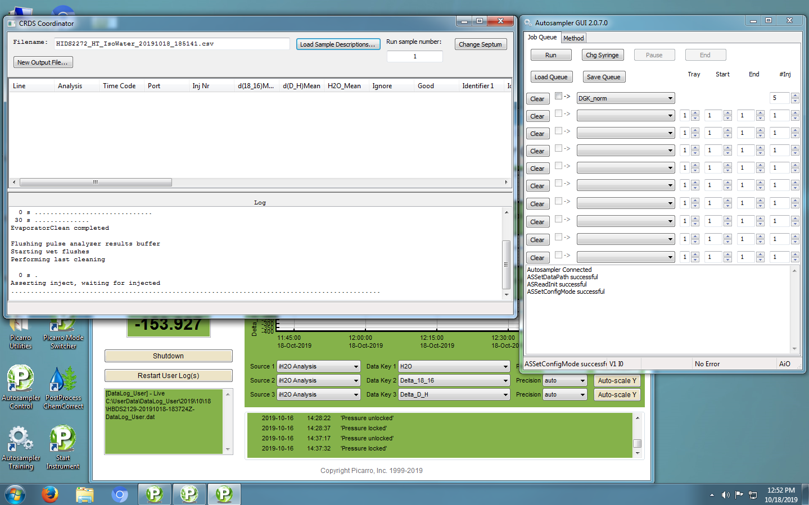
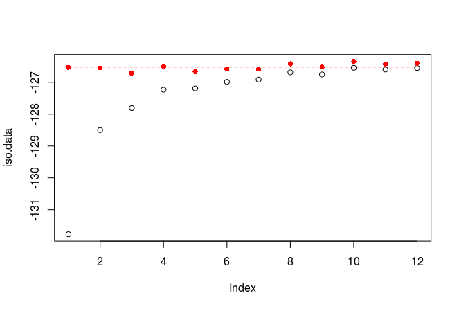

```{r setup, include=FALSE}
knitr::opts_chunk$set(echo = FALSE)
library(tidyverse)
```

## Review of stable water isotopes

Testing of LaTex math equations

$$
\delta = \left[ \frac{R_{sample}}{R_{standard}} - 1 \right]
$$

$$
\delta D = 8\delta^{18}O + 10 \:^0\!\!/\!_{00} 
$$

## How CRDS works {.columns-2}

- Tunable laser (controlled by wavelength monitor)
  - Tuned to absorption spectra of target species
- Laser circulates in cavity (~20 km pathlength)
- Laser shuts off and laser light leaks out (ring down)
  - Partially transparent mirror to photo dector
  - Rate of intesnity decay proportional to concentration of interested species
- Permits detection sensitivity up to parts-per-billion


```{r, out.width = "95%", fig.cap= "Courtesy of Picarro (2018)", echo=FALSE}

```

# Sample preparation

## Vial preparation

- Minimize headspace
- Ensure no cross-contamination between samples
- Ensure proper fit/closure of vial caps

## Isotope standards

- Minimize ambient exposure
- Ensure tight seal with parafilm after replacing lid

## Tray template

```{r, out.width = "100%", fig.cap= "", echo=FALSE}

```

# Operating procedures

---

**Do not attempt to operate the Picarro without either the lab manager or Dr. Rupper present!**

You will primarily use two applications when measuring and recording isotope data: the "Autosampler Control" and the "Coordinator Launcher"
- The first tells the Picarro where the samples are, how many injections to perform, etc.
- The second controls the measurement and recording the data analysis

The next few slides walk through the process of setting up and running isotope analyses

*Note: These instructions assume the instrument is already properly booted, with the CRDS Data Viewer open and actively measuring values. 
If this is not the case, see the lab manager or Dr. Rupper for assistance.*

---

```{r, out.width = "100%", fig.cap= "", echo=FALSE}

```

## 1. Launch the "Autosampler Control" application

```{r, out.width = "95%", fig.cap= "", echo=FALSE}

```

---

This launches the following window

```{r, out.width = "100%", fig.cap= "", echo=FALSE}

```

## 2. Configure the sample/injection layout

- The layout will be based on your previously-completed tray template
- Use the "DGK_norm" method for all injections
- Standards should have 10 injections per vial
- Samples and QCs should have 5 injections per vial
- Remember that port numbers and sample numbers are usually not the same thing
- Make sure the box is checked for each line you wish to actually run

## 3. Launch the "Coordinator Launcher" application

```{r, out.width = "75%", fig.cap= "", echo=FALSE}

```

Prior to launching the Coordinator, ensure that the "Autosampler Control" window is still open

## {.columns-2}

- The Coordinator has 3 possible modes of operation: "High precision", "high throughput", and "manual injections"
  - High precision is...more precise
  - High throughput is faster (takes ~4 minutes per injection compared to HP's 9 minutes)
  - Manual injections does not use the autosampler (you likely will never use this mode)
- Select a mode and click "Launch"

```{r, out.width = "95%", fig.cap= "", echo=FALSE}

```

---

The below window should then launch, with updating information on the current state of analysis

```{r, out.width = "100%", fig.cap= "", echo=FALSE}

```

---

Also note the filename at the top of the window. 
Make sure you know what it is so you can find later find the completed analysis file and copy it to the external drive.

## 4. Start your isotope run

- Return to the "Autosampler Control" window and press the "Run" button
  - This will start the analysis (once the Coordinator has completed its initial start-up procedures)

```{r, out.width = "85%", fig.cap= "", echo=FALSE}

```


## Data extraction

After the Picarro completes analysis on all samples:

- Exit out of the "Coordinator" window and then the "Autosampler Control" window
- Save a copy of the .csv file to the designated USB drive (don't simply use your own)
  - Files are saved in the `C:/IsotopeData/` folder
  - Naming convention is "HIDS2272_IsoWater_*" with the starting date and time of the run

# Data Reduction and IsoReduce

The concept of isotope data reduction is to take raw data (multiple measurements per injections, multiple injections per sample, etc.) and reduce those into a single measurement per sample, while correcting the data for any known biases or errors.
`IsoReduce` is the custom U of U Cryosphere software built for this purpose.
It coerrects for inter-injection memory, intra-run measurement drift, and systemic isotope biases using in-lab isotope standards, and averages corrected injections into a final single measurement for each sample.
The reduction process is divided into three principle sub-routines: memory correction, drift correction, and measurement bias correction.

## Memory correction

Due to the nature of cavity ringdown spectroscopy, a given injection's value will be influenced by the preceding injection values. 
IsoReduce uses two methods to correct for this. 
The first is a geometric mixing model, which we use for corrections of samples with fairly similar isotopic values.
The second is a power-series curve-fitting routine, which we use for samples with a wider spread in isotopic values.

---

### Geometric mixing model

This assumes a given injection's measured value $\delta_i$ is a geometrically-weighted sum of the sample's true value $\delta_T$ and the measured injections preceding it.

$$
\delta_i = \frac{1}{\mathcal{F_N}} \left( \delta_T + \sum_{k=1}^n r^k \delta_{i-k} \right)
$$

$$
\mathcal{F_N} = \sum_{k=0}^n r^k
$$

The equation for the injection's true value is therefore:

$$
\delta_T = \delta_i \sum_{k=0}^n r^k - \sum_{k=1}^n \delta_{i-k}
$$

---

### Power-series curve fitting

For samples with sufficiently large differences in isotopic value, the memory effects are more drastic, but also more predictable.
We can leverage the larger spread and the observed exponential trend in the data to correct for the memory effect.
We fit a power series curve ($Ax^{b}$) by optimizing the choice of the parameters $A$ and $b$ (where $x$ is the injection number), and use it to correct the injections for memory effects.

---



## Drift Correction

Over time, CRDS instrument values can *drift* away from previously measured values, even if the true values remain unchanged. 
This usually has to do with minor differences in the reference laser wavelength or electric current output.
Although one of the primary advantages of the Picarro instruments over other CRDS competitors is the relatively low drift, we still provide corrections for any residual deviations.
We do this by comparing the starting, stopping and (if present) intra-run isotope standard values for changes in measured value throughout the run.
We then remove the time-interpolated drift effect from all sample injections.

---

```{r, echo=FALSE}
data = tibble(Sample_num = 1:26, Sample_ID = c("STND1", "STND2", rep("smp",10), 
                                               "STND1", "STND2", rep("smp",10), 
                                               "STND1", "STND2"))
STND1 = -235
STND2 = -110
smp1 = rnorm(10, mean = mean(c(STND1,STND2)), sd = abs(STND1-STND2)/4)
smp2 = rnorm(10, mean = mean(c(STND1,STND2)), sd = abs(STND1-STND2)/4)
data = data %>% mutate(dD = c(STND1, STND2, smp1, STND1+12, STND2+5, smp2, STND1+20, STND2+14))

drift.plot = ggplot() + geom_point(filter(data, Sample_ID == "smp"), mapping = aes(x=Sample_num, y=dD)) + 
  geom_point(filter(data, Sample_ID == "STND1"), mapping=aes(x=Sample_num, y=dD), color = 'red') + 
  geom_point(filter(data, Sample_ID == "STND2"), mapping=aes(x=Sample_num, y=dD), color = 'red') + 
  geom_smooth(filter(data, Sample_ID == "STND1"), mapping=aes(x=Sample_num, y=dD), 
              color = 'red', method = 'lm', se = FALSE) + 
  geom_smooth(filter(data, Sample_ID == "STND2"), mapping=aes(x=Sample_num, y=dD), 
              color = 'red', method = 'lm', se = FALSE)
print(drift.plot)
```

## Measurement bias

In most cases, a measurement bias is introduced in isotope value estimates, where the measured values systemically differ from the true values.
This is true even when the measurements are sufficiently precise and properly corrected for memory effects and drift effects.
We therefore use the measured values of our known isotope standards to *standardize* the measured values of isotope samples to their true values, relative to the standards used.

## Using IsoReduce

- Go to https://github.com/UofU-Cryosphere/IsoReduce and change the branch to `iso-class`
- Download the compressed repository to a location of your choosing and unzip it
- The "Raw Data" folder contains some example isotope runs you can play around with
- Use the "reducer.R" wrapper script to run the reduction software
  - You may need to install some additional packages...

---

### Reducer.R

```{r, eval=FALSE, echo=TRUE}
# Script used to reduce isotope data based on the custom function 'iso.reduce'

# Import required libraries
library(tidyverse)
library(readxl)
library(here)

# Select the .csv file containing the final raw data as outputed by the Picarro
files.paths = file.choose()

# Select the .xlsx file containing the properly formatted and standardized tray template for this run
template.path = file.choose()

# Source and run the isotope reduction functions on given input files
source('R-functions/iso.reduce.R')
reduced.data = iso.reduce(files.paths, template.path)

# Plot d18O values of reduced data
reduced.data %>% ggplot(., aes(x=1:nrow(.), y=d18O.correct)) + geom_point()

# Plot dD values of reduced data
reduced.data %>% ggplot(., aes(x=1:nrow(.), y=dD.correct)) + geom_point()
```
